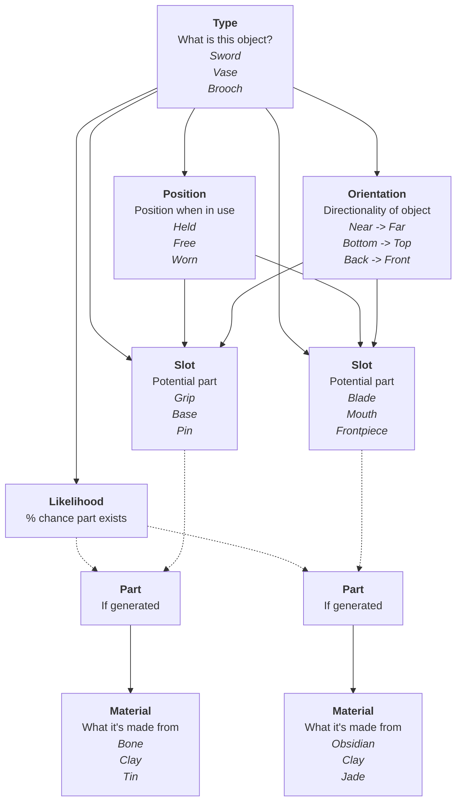

# Those Who Came Before

## What is TWCB About?

A narrative game about understanding vanished cultures by interpreting procedurally generated artefacts.

### What is TWCB *Really* About?

It's about how we talk about other people, and the self-imposed limits we create through our assumptions.

### Inspiration

- Mali & its amazing history
- All the knowledge lost when Mayan books were burned
- The Bronze Age Collapse
- The Basque language's lost relatives

## Development

### What's the Latest Feature?

A basic artefact generator & web UI. It currently generates lists of 5 unique artefacts, each comprising a type of object (axe, urn, etc) and a material it's made from (wood, bone, etc).

### What's the Current Focus?

I'm working on a template object for artefacts that will allow dynamic generation of artefacts with variable (but reasonable) constructions.

The system also needs to scale to further complexity well, because after item generation is nailed down I'll need to make sure that a culture can generate multiple items that feel coherent. Here's some initial ideas for that...

- if a sword lacks a crossguard, further swords from that culture should have a reduced chance of generating crossguards
- the use of a material can...
  - increase the likelihood of that material being used by that culture ("*we use Obsidian*")
  - **significantly** increase the likelihood of that material being used by that culture **in similar contexts** ("*we make blades out of obsidian*")

More abstracted inferences can be drawn from emergent patterns:

- Patterns
  - Ornamental items
    - 3 have been generated
    - jade was present in 2 of them
  - Utility items
    - 2 have been generated
    - jade was present in neither of them
- Inferences
  - Jade is a decorative material

### Progress Chart

| # | Theme | Status | Next | Branch | Needs |
| :---: | :---: | :---: | :---: | :---: | :---: |
| 1 | **Interface** | Basic generator | - | - | #3 |
| 2 | **Artefact Generation** | item-material pairs | item traits | - | #3 |
| 3 | **Artefact Generation** | - | Dynamic blueprints | itemAnatomy | - |
| 4 | **Devlog** | README.md | generated site | - | - |

## Other Info

### Badges

