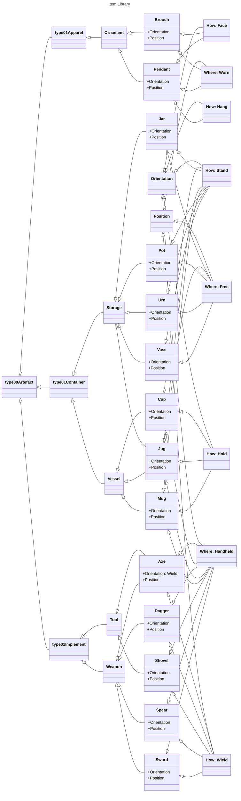

# Artefacts & Properties

```mermaid
---
title: Item Library
---
classDiagram
direction LR
class trait00["Orientation"]
	trait00 <|-- trait00Face
	trait00 <|-- trait00Hang
	trait00 <|-- trait00Hold
	trait00 <|-- trait00Stand
	trait00 <|-- trait00Wield
class trait00Face["How: Face"]
class trait00Hang["How: Hang"]
class trait00Hold["How: Hold"]
class trait00Stand["How: Stand"]
class trait00Wield["How: Wield"]

class trait01["Position"]
	trait01 <|-- trait01Free
	trait01 <|-- trait01Held
	trait01 <|-- trait01Worn
class trait01Free["Where: Free"]
class trait01Held["Where: Handheld"]
class trait01Worn["Where: Worn"]

class type00Artefact
	type00Artefact <|-- type01Apparel
	type00Artefact <|-- type01Container
	type00Artefact <|-- type01Implement

class type01Apparel
	type01Apparel <|-- type02Ornament
class type01Container
	type01Container <|-- type02Store
	type01Container <|-- type02Vessel
class type01Implement
	type01Implement <|-- type02Tool
	type01Implement <|-- type02Weapon

class type02Ornament["Ornament"]
	type02Ornament <|-- type03Brooch
	type02Ornament <|-- type03Pendant
class type02Store["Storage"]
	type02Store <|-- type03Jar
	type02Store <|-- type03Jug
	type02Store <|-- type03Pot
	type02Store <|-- type03Urn
	type02Store <|-- type03Vase
class type02Tool["Tool"]
	type02Tool <|-- type03Axe
	type02Tool <|-- type03Shovel
class type02Vessel["Vessel"]
	type02Vessel <|-- type03Cup
	type02Vessel <|-- type03Jug
	type02Vessel <|-- type03Mug
class type02Weapon["Weapon"]
	type02Weapon <|-- type03Axe
	type02Weapon <|-- type03Dagger
	type02Weapon <|-- type03Spear
	type02Weapon <|-- type03Sword

class type03Axe["Axe"]{
		+Orientation: Wield
		+Position 
}
	type03Axe <|-- trait00Wield
	type03Axe <|-- trait01Held
class type03Brooch["Brooch"]{
		+Orientation 
		+Position 
}
	type03Brooch <|-- trait00Face
	type03Brooch <|-- trait01Worn
class type03Cup["Cup"]{
		+Orientation 
		+Position 
}
	type03Cup <|-- trait00Hold
	type03Cup <|-- trait00Stand
	type03Cup <|-- trait01Held
class type03Dagger["Dagger"]{
		+Orientation 
		+Position 
}
	type03Dagger <|-- trait00Wield
	type03Dagger <|-- trait01Held
class type03Jar["Jar"]{
		+Orientation 
		+Position 
}
	type03Jar <|-- trait00Stand
	type03Jar <|-- trait01Free
class type03Jug["Jug"]{
		+Orientation 
		+Position 
}
	type03Jug <|-- trait00Hold
	type03Jug <|-- trait00Stand
	type03Jug <|-- trait01Free
	type03Jug <|-- trait01Held
class type03Mug["Mug"]{
		+Orientation 
		+Position 
}
	type03Mug <|-- trait00Hold
	type03Mug <|-- trait00Stand
	type03Mug <|-- trait01Held
class type03Pendant["Pendant"]{
		+Orientation 
		+Position 
}
	type03Pendant <|-- trait00Face
	type03Pendant <|-- trait00Hang
	type03Pendant <|-- trait01Worn
class type03Pot["Pot"]{
		+Orientation 
		+Position 
}
	type03Pot <|-- trait00Stand
	type03Pot <|-- trait01Free
class type03Shovel["Shovel"]{
		+Orientation 
		+Position 
}
	type03Shovel <|-- trait00Wield
	type03Shovel <|-- trait01Held
class type03Spear["Spear"]{
		+Orientation 
		+Position 
}
	type03Spear <|-- trait00Wield
	type03Spear <|-- trait01Held
class type03Sword["Sword"]{
		+Orientation 
		+Position 
}
	type03Sword <|-- trait00Wield
	type03Sword <|-- trait01Held
class type03Urn["Urn"]{
		+Orientation 
		+Position 
}
	type03Urn <|-- trait00Stand
	type03Urn <|-- trait01Free
class type03Vase["Vase"]{
		+Orientation 
		+Position 
}
	type03Vase <|-- trait00Stand
	type03Vase <|-- trait01Free
```
