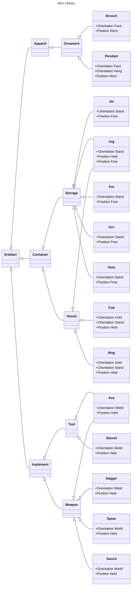

# Artefacts & Properties

```mermaid
---
title: Item Library
---
classDiagram
direction LR

class type00Artefact["Artefact"]
	type00Artefact <|-- type01Apparel
	type00Artefact <|-- type01Container
	type00Artefact <|-- type01Implement

class type01Apparel["Apparel"]
	type01Apparel <|-- type02Ornament
class type01Container["Container"]
	type01Container <|-- type02Store
	type01Container <|-- type02Vessel
class type01Implement["Implement"]
	type01Implement <|-- type02Tool
	type01Implement <|-- type02Weapon

class type02Ornament["Ornament"]
	type02Ornament <|-- type03Brooch
	type02Ornament <|-- type03Pendant
class type02Store["Storage"]
	type02Store <|-- type03Jar
	type02Store <|-- type03Jug
	type02Store <|-- type03Pot
	type02Store <|-- type03Urn
	type02Store <|-- type03Vase
class type02Tool["Tool"]
	type02Tool <|-- type03Axe
	type02Tool <|-- type03Shovel
class type02Vessel["Vessel"]
	type02Vessel <|-- type03Cup
	type02Vessel <|-- type03Jug
	type02Vessel <|-- type03Mug
class type02Weapon["Weapon"]
	type02Weapon <|-- type03Axe
	type02Weapon <|-- type03Dagger
	type02Weapon <|-- type03Spear
	type02Weapon <|-- type03Sword

class type03Axe["Axe"]{
		+Orientation Wield
		+Position Held
}
class type03Brooch["Brooch"]{
		+Orientation Face
		+Position Worn
}
class type03Cup["Cup"]{
		+Orientation Hold
		+Orientation Stand
		+Position Held
}
class type03Dagger["Dagger"]{
		+Orientation Wield
		+Position Held
}
class type03Jar["Jar"]{
		+Orientation Stand
		+Position Free
}
class type03Jug["Jug"]{
		+Orientation Stand
		+Position Held
		+Position Free
}
class type03Mug["Mug"]{
		+Orientation Hold
		+Orientation Stand
		+Position Held
}
class type03Pendant["Pendant"]{
		+Orientation Face
		+Orientation Hang
		+Position Worn
}
class type03Pot["Pot"]{
		+Orientation Stand
		+Position Free
}
class type03Shovel["Shovel"]{
		+Orientation Wield
		+Position Held
}
class type03Spear["Spear"]{
		+Orientation Wield
		+Position Held
}
class type03Sword["Sword"]{
		+Orientation Wield
		+Position Held
}
class type03Urn["Urn"]{
		+Orientation Stand
		+Position Free
}
class type03Vase["Vase"]{
		+Orientation Stand
		+Position Free
}
```
