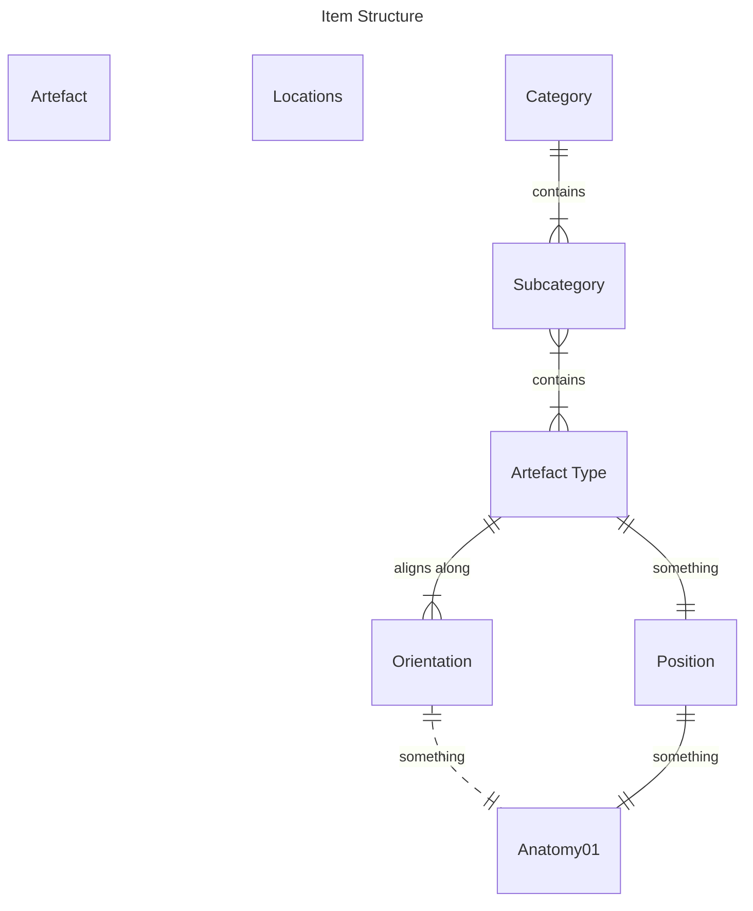

# Properties of Artefacts

```mermaid
---
title: Item Structure
---
erDiagram
%% Thing A -- Thing B : relates
%% Thing A relates to number Thing B
%% Thing B relates to number Thing A

Artefact

Locations

Trait00["Orientation"]
	Trait00 ||..|| Anatomy01 : something
Trait01["Position"]
	Trait01 ||--|| Anatomy01 : something

Type01["Category"]
	Type01 ||--|{ Type02 : contains
Type02["Subcategory"]
	Type02 }|--|{ Type03 : contains
Type03["Artefact Type"]
	Type03 ||--|{ Trait00 : "aligns along"
	Type03 ||--|| Trait01 : "something"
```
