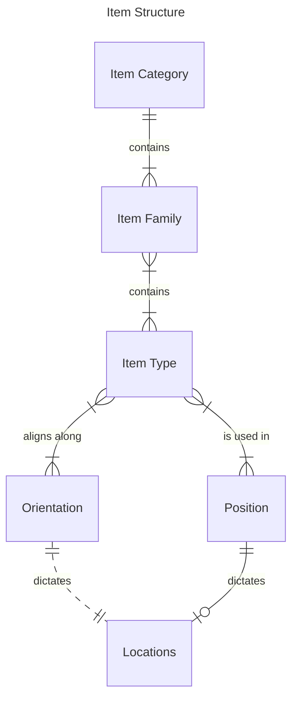

# Properties of Artefacts

```mermaid
---
title: Item Structure
---
erDiagram
Locations
Orientation
	Orientation ||..|| Locations : "dictates"
Position
	Position ||--o| Locations : "dictates"

Category["Item Category"]
	Category ||--|{ Family : "contains"
Family["Item Family"]
	Family }|--|{ Type : "contains"
Type["Item Type"]
	Type }|--|{ Orientation : "aligns along"
	Type }|--|{ Position : "is used in"
```
